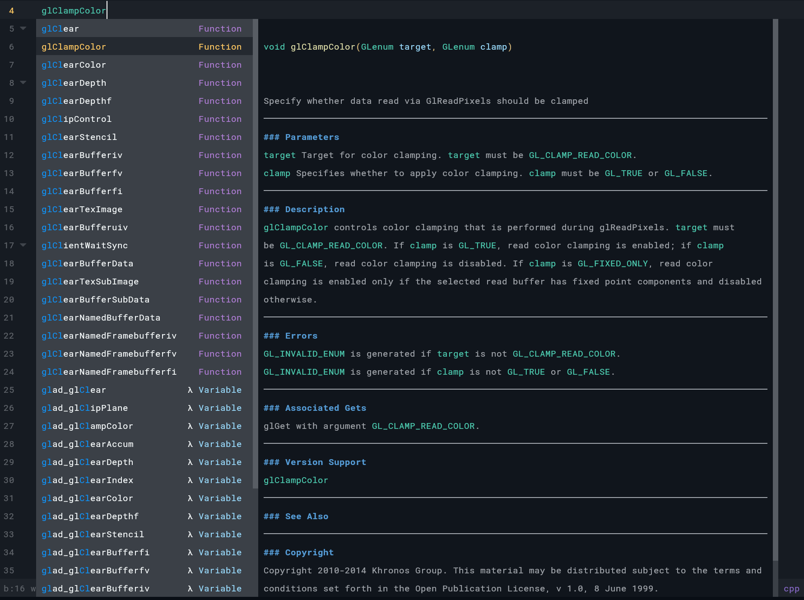

# cmp-gl
---
nvim-cmp source for OpenGL api functions.

This is helpful when using libraries like glad that obfuscate the underlying api with macros.

The completion documentation for function calls is parsed from the gl4 xml files found at [KhronosGroup/OpenGL-Refpages](https://github.com/KhronosGroup/OpenGL-Refpages/tree/main/gl4).

The completion for OpenGL constants (e.g GL_TRIANGLES, GL_VERTEX_ARRAY_SIZE, etc) is also added but the documentation is omitted.

Currently the completions will display for c/cpp filetypes. And are triggered when typing:
- `gl` for function calls, e.g glEnable
- `GL_` for prefixed constants

---

Setup

```lua

-- Place cmp_gl above nvim_lsp

require('cmp').setup({
  sources = {
    { name = 'cmp_gl' },
    { name = 'nvim_lsp' },
  },
})

-- https://github.com/hrsh7th/nvim-cmp/issues/999
-- You may need to fix clangd indentation issue
-- with `--header-insertion-decorators=false`

vim.lsp.start({
  name = 'clangd',
  cmd = { 'clangd', '--malloc-trim', '-j=2', '--header-insertion-decorators=false' },
  ...
})
```

---

 

---

If you are looking for completions for GLSL, checkout [glsl_analyzer](https://github.com/nolanderc/glsl_analyzer).
