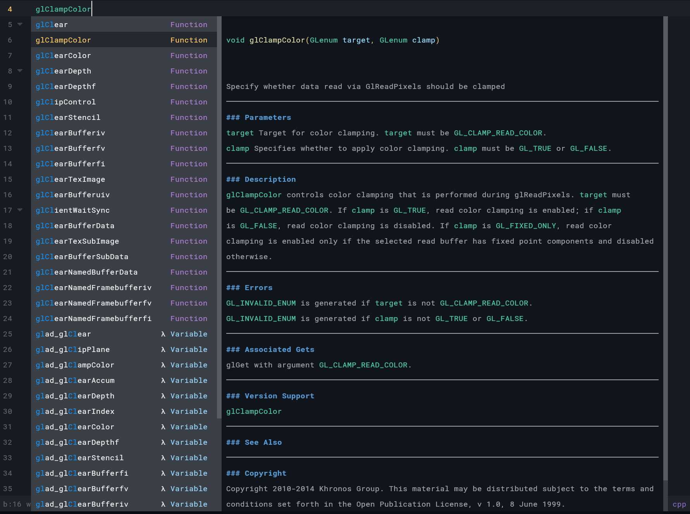

# cmp-gl

---

Source completions and snippets for OpenGL api functions for
[nvim-cmp](https://github.com/hrsh7th/nvim-cmp) or
[blink.cmp](https://github.com/saghen/blink.cmp).

This is helpful when using libraries like glad that obfuscate the underlying api
with macros.

The completion documentation for function calls is parsed from the gl4 xml files
found at
[KhronosGroup/OpenGL-Refpages](https://github.com/KhronosGroup/OpenGL-Refpages/tree/main/gl4).

The completion for OpenGL constants (e.g GL_TRIANGLES, GL_VERTEX_ARRAY_SIZE,
etc) is also added but the documentation is omitted.

By default the completions will display for c/cpp filetypes and insert c/cpp
compatible code.

If you are looking for completions for GLSL, checkout
[glsl_analyzer](https://github.com/nolanderc/glsl_analyzer).

You need to specify `provider=blink|nvim-cmp` in the setup to enable the completions.

---

## blink.cmp setup:

```lua
  {
    'vurentjie/cmp-gl',
    config = function()
      require('cmp_gl').setup({
        provider = 'blink',
        snippets = false,  -- if you prefer snippets that allow jumping to each param
      })
    end,
  },
  {
    'saghen/blink.cmp',
      opts = {
      sources = {
        default = { 'cmp_gl' },
        providers = {
          cmp_gl = {
            name = 'cmp_gl',
            module = 'cmp_gl',
        }
      }
    }
  }
```

## nvim-cmp setup:

There are two steps to enable completions:

```lua

-- Place cmp_gl above nvim_lsp in the sources

require('cmp').setup({
  sources = {
    { name = 'cmp_gl' },
    { name = 'nvim_lsp' },
  },
})

-- https://github.com/hrsh7th/nvim-cmp/issues/999
-- You may need to fix clangd indentation issue
-- with `--header-insertion-decorators=false`

vim.lsp.start({
  name = 'clangd',
  cmd = { 'clangd', '--malloc-trim', '-j=2', '--header-insertion-decorators=false' },
  ...
})

{
  'vurentjie/cmp-gl',
  config = function()
    require('cmp_gl').setup({
      provider = 'nvim-cmp',
      move_cursor = true, -- jump to the first function param after completion (ignored for snippets)
      snippets = false,  -- if you prefer snippets that allow jumping to each param
    })
  end,
},

```




---

### Enabling/disabling filetypes:

If you want to see completions in other filetypes you can do that but note that
this will still insert c-style code.

```lua
require('cmp_gl').enable_filetype('<filetype>')
require('cmp_gl').disable_filetype('<filetype>')
```

